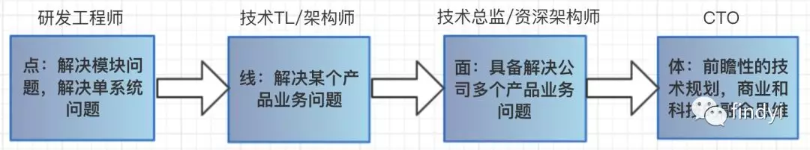
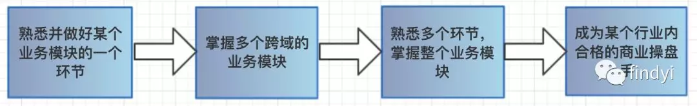

1、什么叫知识体系化能力？
2、知识体系化能力有什么用，解决什么问题？
3、怎么能够到达知识体系化能力？

1、什么叫知识体系化能力？
我的理解，能够快速用自己现有综合知识，快速找到问题解决方案，并能快速梳理各种解决方案优缺点（注意解决问题办法不只有1个，俗话说的好，办法总是比问题多）。

2、知识体系化能力有什么用，解决什么问题？
能够快速的定位问题，以及清晰知道每个流程环节，给出最优解。

例如，
>有这样一个问题，你会写脚手架吗？你是怎么写的？
>作为普通研发工程师，大多数人会有2种回答：
> - 第 1 种，“不是很会，但是了解webpack知识，能够改造vue/react官方提供的脚手架，贬称公司项目使用脚手架”。
> - 第 2 种，“会啊，我能用 webpack/rollup 模仿写个react/vue脚手架”。
> 
>想想，这2种回答，听着就很干瘪，没什么亮点。作为高级研发工程师/架构师/技术tl，就不得全面考虑一番才回答，这里说“全面”就是我所说体系化。针对这个问题，可以明确一点：**它不是问你会不会使用webpack/rollup构建工具，而是考你有没有把脚手架开发当成一个项目研发问题**。既然说研发问题，就可以从以下几个方面回答：
> - **脚手架怎么设计？**（此问题可以拆解多个小问题：市面上脚手架有哪些？它们有哪些功能？我们脚手架，应该具有什么功能？）
> - **脚手架怎么开发？**（这里开发，不只限一个开发人员，甚至还涉及多个团队，所以我们制定配套协同流程，git版本管理流程）
> - **脚手架怎么发布？**（这里发布，不仅仅脚手架自身发布，脚手架构建产物版本npm版本、cdnjs 版本，市面上 semver 语义版本规范，可以参考一下，制定配套版本规范。另外，不是人人都具有发布权限，尤其团队人数多，可能需要增加版本经理角色，去专门管理这些版本发布。当然还要自动化ci/cd，小公司采用市面主流一些工具，但大公司可能采用自己研发的或购买的，可能不那么自动化，需要我们自身想办法去设计一套自动化）
> - **脚手架怎么使用？**（这个是不算太重要，在设计阶段就改想好的，像yomen那样使用，还是像vue-cli那样使用，这个取决当时诉求，如果简单点yomen，复杂点cli）
> - **可能遇到问题，改怎么解决的？**（调试、bug修复、脚手架市面上工具，都要做一些考虑）
 
这样的回答是不是更好一些？当然，能这样回答的程序员的级别也是高一些的。所以，如果要做到高级以上，就应该具备知识体系化能力。当然，体系化能力也分等级，可以参考下图：

了解这些后，就的说第 3 个问题，如何达到知识化体系能力？

3、怎么能够到达知识体系化能力？

这里，我给自己定 4 个目标。

1、会写脚手架（组件库、js-sdk库、业务项目脚手架，nodejs 工具库）
2、对于性能优化，有着自己一套优化方案
3、会写项目构建、发布脚本，能够管理代码版本、发布、codereview
4、将自己目前手上业务项目逻辑梳理，列举业务项目问题，并制定合理解决方案。